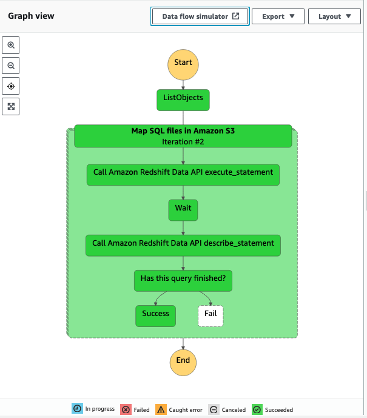

# Orchestrate Amazon RedShift Queries with AWS Step Functions

These instructions will show you how to orchestrate SQL calls to an Amazon Redshift database. The trigger in this example is time based and runs nightly, initiating a sequence of SQL quieres that are stored in an Amazon S3 bucket. 



## AWS Resources

Follow these steps to create the required AWS resources.

### Amazon S3 bucket

Create an Amazon S3 bucket in ap-southeast-2 to store SQL files. You can group the sql files into folders to so they are easier to keep organized.

* Create a folder: development
* Add 3 text files that each contain only the string of a SQL query 
  * Filename: e.g. sql-query-alpha-v1.sql
  * Add content from a text editor, e.g. SELECT * FROM "sample_data_dev"."tickit"."listing";
* For each file record the bucket name and object key 
  * bucket_name: redshift-sql-queries-190067120391
  * object_key: development/sql-queury-alpha-v1.sql

### Secrets Manager

Store the Redshift credentials in AWS Secrets Manager - https://docs.aws.amazon.com/redshift/latest/mgmt/data-api.html#data-api-secrets

* Create a new Secret for Amazon Redshift
* Secret type: Credentials for Redshift cluster
* Enter user name, password, and dbClusterIdentifier
  * Name: redshift-cluster-v1
  * Tag: key: RedshiftDataFullAccess, value: cluster|serverless 

The AWS-managed policy AmazonRedshiftDataFullAccess only allows the action secretsmanager:GetSecretValue for secrets tagged with the key RedshiftDataFullAccess. 

## AWS Lambda function

Create an Amazon Lamba function that has the input of an S3 object ARN. The Lamba function will need an IAM role that has the appropriate permission to read from an Amazon S3 bucket, e.g. attach the IAM AmazonS3ReadOnlyAccess permission to the function’s role. Permission to access Redshift and Secrets Manager.

Load from S3 - https://docs.aws.amazon.com/step-functions/latest/dg/avoid-exec-failures.html

Lambda function query Redshift - https://aws.amazon.com/premiumsupport/knowledge-center/redshift-lambda-function-queries/ 

* Create function: load-redshift-sql-from-s3-v1
  * Runtime: Python 3.9
  * Under configuration 
    * Permissions, open the Role name and add the IAM AmazonS3ReadOnlyAccess, AmazonRedshiftDataFullAccess, and SecretsManagerReadWrite permissions
  * Basic settings 
    * Timeout to 30 seconds

Code is based on boto3 execute statement - https://boto3.amazonaws.com/v1/documentation/api/latest/reference/services/redshift-data.html#RedshiftDataAPIService.Client.execute_statement 

### Code

Copy the lambda_function.py content in the aws-lambda/load-redshift-sql-from-s3-v1 folder.

* Update the Secrets Manager secret name
* Update the Amazon Redshift database name

### Test

Create two test objects and test.

The s3_bucket_name and s3_object_key should match a file name in the bucket above.

#### Test 1

```json
{
  "s3_bucket_name": "redshift-sql-queries-190067120391",
  "s3_object_key": "development/sql-queury-alpha-v1.sql"
}
```
Response example:
```json
{
  "s3_bucket_name": "redshift-sql-queries-190067120391",
  "s3_object_key": "development/sql-queury-alpha-v1.sql",
  "execute_statement_id": "5e47ccda-3b89-4afb-b323-c669116cc4ad"
}
```

#### Test 2
```json
{
  "s3_bucket_name": "redshift-sql-queries-190067120391",
  "s3_object_key": "development/sql-queury-alpha-v1.sql",
  "execute_statement_id": "6452f624-8d27-4698-b8e9-6472536a7a16"
}
```
Response example:
```json
{
  "s3_bucket_name": "redshift-sql-queries-190067120391",
  "s3_object_key": "development/sql-queury-alpha-v1.sql",
  "execute_statement_id": "6452f624-8d27-4698-b8e9-6472536a7a16",
  "query_status": "FINISHED"
}
```


## AWS Step function

In the AWS Step Functions service, create a new state machine that will orchestrate the call the lambda function that reads the SQL for each query file.

* Write your workflow in code
* Type: standard
* Name: redshift-query-v1
* Permissions: Create new role

The new IAM role needs permission to read from the Amazon S3 bucket.

### Code

Copy the redshift-query-v1.json content in the aws-step-functions folder.

Update the AWS Lambda Invoke function to the load-redshift-sql-from-s3-v1 function.

### Test

Test by starting execution with empty input.

## Amazon EventBridge (formerly CloudWatch Events)

EventBridge lets you create event driven or scheduled rules that we can use to trigger the AWS Step Function.

An example is here: https://aws.amazon.com/getting-started/hands-on/scheduling-a-serverless-workflow-step-functions-cloudwatch-events/

* Create a rule
* Name: trigger-redshift-step-function-v1
* Rule type: schedule
* Set the schedule pattern (set a short period to test and longer one later)
* Define Target 1 
  * AWS service
  * Step Functions state machine – redshift-query-v1
